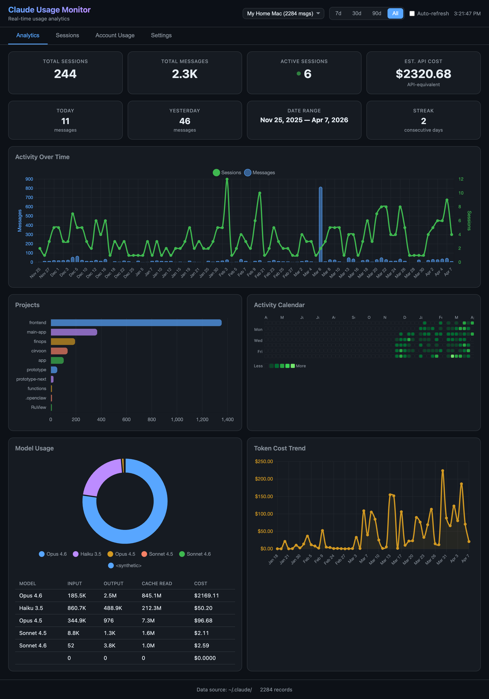
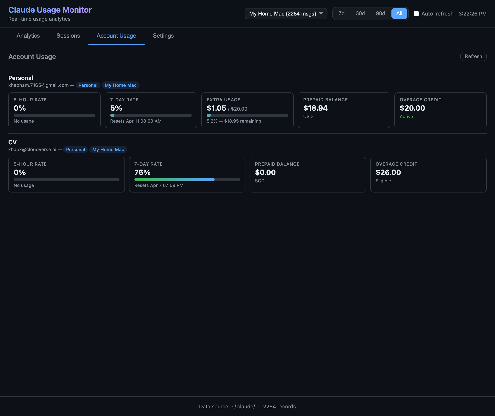
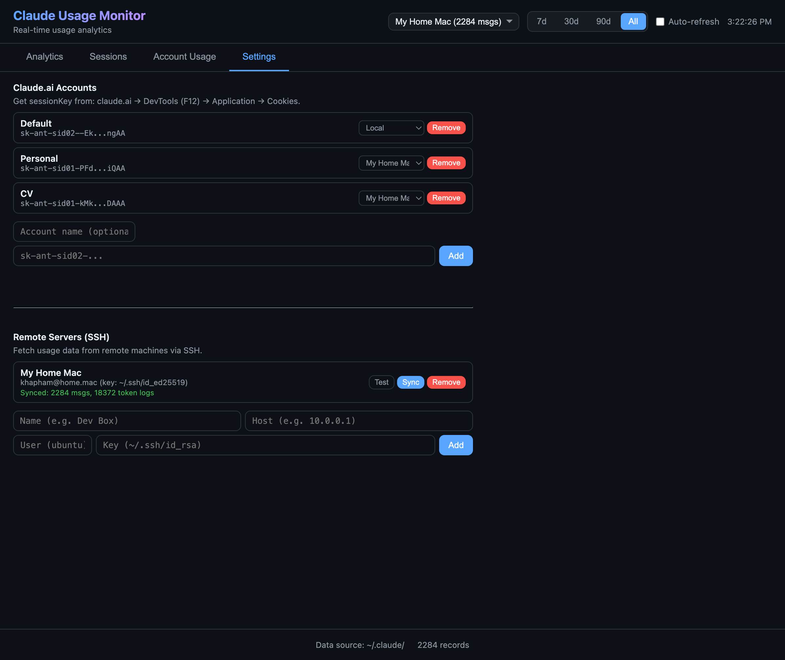

# Claude Usage Monitor

A beautiful, self-hosted dashboard to monitor your [Claude](https://claude.ai) usage across multiple accounts and machines.


[](https://python.org)
[](https://flask.palletsprojects.com)
[](LICENSE)

<p align="center">
  
</p>

## Features

**Analytics Dashboard** -- Visualize your Claude Code usage with interactive charts

- Daily/weekly/monthly activity trends with session overlays
- GitHub-style activity calendar (contribution heatmap)
- Per-project message breakdown
- Model usage distribution (Opus, Sonnet, Haiku)
- Token cost trend over time
- Streak counter and daily comparisons

**Multi-Account Monitoring** -- Track usage across all your Claude accounts

- Personal and Enterprise/Team account support
- 5-hour and 7-day rate limit tracking
- Extra usage spend with progress bars
- Prepaid balance and overage credit visibility
- Link accounts to specific machines

**Session Management** -- See what's running and take action

- Active sessions across local + remote machines
- One-click session termination (local and remote)
- Full session history with source tags

**Remote Server Support** -- Monitor Claude usage on any machine via SSH

- Add servers with SSH key authentication
- Background sync with real-time progress
- Synced data persists to disk across restarts
- Source filter to view per-machine or combined stats

## Quick Start

**Prerequisites:** Python 3.9+ ([install](https://python.org/downloads))

```bash
git clone https://github.com/khapk/claude-usage-monitor.git
cd claude-usage-monitor
./start.sh
```

Dashboard opens automatically at **http://localhost:5111**

That's it. One script, no database, no Docker, no build step. `start.sh` installs dependencies and launches the server.

## macOS App (Optional)

Build a native `.app` you can keep in your Dock:

**Prerequisites:** Python 3.9+, then install pywebview:

```bash
pip3 install pywebview
./build_app.sh
```

The app is created at `dist/Claude Usage Monitor.app`. Drag it to `/Applications`.

> The app opens a native macOS window (WebKit) — no browser tab needed.

## Setup

### Requirements

- Python 3.9+
- A machine running [Claude Code](https://claude.ai/code) (the `~/.claude/` directory)

### Manual start

```bash
pip install -r requirements.txt
python app.py
```

### Track Account Usage (Optional)

To see rate limits and spend tracking from claude.ai:

1. Go to [claude.ai](https://claude.ai) and log in
2. Open DevTools (F12) > Application > Cookies
3. Copy the `sessionKey` value
4. Paste it in **Settings > Claude.ai Accounts > Add**

### Add Remote Servers (Optional)

To aggregate usage from other machines:

1. Go to **Settings > Remote Servers**
2. Enter hostname, username, and SSH key path
3. Click **Test** to verify, then **Sync** to pull data

## Screenshots

### Analytics
Activity charts, project breakdown, GitHub-style calendar, model usage, and cost trends.


### Account Usage
Real-time rate limits, extra usage tracking, prepaid balance, and overage credits for multiple accounts.



### Settings
Manage Claude.ai accounts with source linking, and SSH remote servers with test/sync controls.



## How It Works

Claude Code stores usage data locally in `~/.claude/`:

| File | What it contains |
|------|-----------------|
| `history.jsonl` | Every message you send (timestamps, projects, sessions) |
| `projects/*/session.jsonl` | Detailed logs with token counts per model |
| `sessions/*.json` | Active session metadata (PID, working directory) |

This app reads those files, computes analytics, and serves a web dashboard. For account usage (rate limits, spend), it uses your `sessionKey` cookie to query the claude.ai API via [cloudscraper](https://github.com/VeNoMouS/cloudscraper).

No data leaves your machine. Everything runs locally.

## Architecture

```
~/.claude/          Flask Backend           Browser Dashboard
  history.jsonl  -->  parsers.py     -->   Analytics tab
  projects/*     -->  aggregators.py -->   Charts (Chart.js)
  sessions/*     -->  active_sessions.py   Sessions tab

claude.ai API    -->  claude_web.py  -->   Account Usage tab
SSH servers      -->  ssh_collector.py     (background sync)
```

## Tech Stack

- **Backend**: Python + Flask (single file, no framework bloat)
- **Frontend**: Vanilla HTML/CSS/JS + Chart.js (no build tools)
- **SSH**: Paramiko (reads remote `~/.claude/` data via `exec_command`)
- **Claude.ai API**: Cloudscraper (bypasses Cloudflare for usage data)
- **Storage**: JSON files only (`.config.json` + `.cache/`)

## Configuration

All settings are stored in `.config.json` and browser `localStorage`. No environment variables needed.

```json
{
  "accounts": [
    {
      "id": "acc-a1b2c3d4",
      "name": "Work",
      "session_key": "sk-ant-sid02-...",
      "linked_source": "local"
    }
  ],
  "ssh_servers": [
    {
      "id": "srv-e5f6g7h8",
      "name": "Dev Box",
      "host": "10.0.0.1",
      "user": "ubuntu",
      "key_path": "~/.ssh/id_rsa"
    }
  ]
}
```

## API Endpoints

| Endpoint | Description |
|----------|-------------|
| `GET /api/overview?days=N&source=S` | Summary stats |
| `GET /api/activity/daily?days=N` | Daily message/session counts |
| `GET /api/projects` | Per-project breakdown |
| `GET /api/tokens` | Per-model token usage + cost |
| `GET /api/sessions` | Session history |
| `GET /api/sessions/active` | Running Claude processes |
| `POST /api/sessions/kill` | Terminate a session |
| `GET /api/accounts` | List Claude.ai accounts |
| `GET /api/accounts/:id/usage` | Account usage + rate limits |
| `GET /api/sources` | List SSH servers |
| `POST /api/sources/:id/sync` | Trigger background sync |

All data endpoints accept `?source=local` or `?source=ssh:server-id` to filter.

## Contributing

PRs welcome. The codebase is intentionally simple -- vanilla JS, no frameworks, no build step.

```
claude-usage-monitor/
  app.py              # Flask routes
  backend/
    parsers.py        # Read ~/.claude/ files
    aggregators.py    # Compute stats + merge sources
    ssh_collector.py  # Remote data via SSH
    claude_web.py     # claude.ai API (multi-account)
    active_sessions.py # Process detection
    cost_model.py     # Token pricing
  static/
    js/app.js         # UI logic
    js/charts.js      # Chart.js wrappers
    css/style.css     # Dark theme
  templates/
    index.html        # Single-page app
```

## License

MIT
